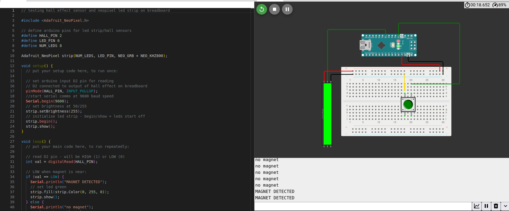

# Lichess LED Board
Repo for code, set up, and building of an Lichess-linked and LED-activated physical chess board to play online or against a computer live with physical pieces.  

## Design approach 
The idea is to have a classic looking wooden board with discreet LEDs allowing the user to play against a chess computer (through Lichess or a local engine) or online with Lichess. This is the proposed setup:  
- Wooden chess set which will be adapted/drilled to fit the PCB and allow clear LED instructions  
- Raspberry pi zero 2 W with python scripts (for Lichess API game access) and to run the local engine
- Arduino connected to the rasbpi for controlling the LEDs and hall effect sensors
- Printed circuit board or breadboard with 64 hall effect sensors and LEDs (one per square)
- LEDs will display the opponent's move uby lighting up origin and destination squares
- Hall effect sensors will detect when and where the user has moved a piece on the physical boadr and this will be transmitted back to the online game

The aim is to create as discreet a board as possible so that it can be played like normal with others without having flashy LEDs or cables protruding out at all times. This is also my first time trying a hardware/electronics project so please provide any feedback or guidance if you can see any errors! 

## Setup
### Pre-filled API token form:  
This is to allow access via Lichess' API token to your games  
https://lichess.org/account/oauth/token/create?scopes[]=challenge:write&scopes[]=puzzle:read&scopes[]=puzzle:write&scopes[]=board:play&description=Prefilled+token+example

## Testing  
As this is my first time carrying out an electronics project and using a pi/arduino/breadboard, it naturally involves a lot of trials and testing. 

Below are some main areas I tested out before trying to implement into the full system:  

### Hall Effect Sensor  
Using a simple breadboard and arduino circuit I wired up the hall effect sensor to activate an LED and print to the CLI when a magnet is detected by the hall effect sensor.  

A simulation on Wowki is available here (note a button is used in place of a hall effect sensor - pressing it mimics presence of a magnet): https://wokwi.com/projects/458314087442075649  

 

Magnet not present:  
  

Magnet present:  

## Prototyping
**Here are some photos from during the prototyping/build of the lichess board:**

  
<em>12/3/26: Setting up the 8xLED strip to light up based on the opponent's move origin and destination file during a live game. Implemented as 3x orange flashes on origin file LED, and a constant green LED on the destination file LED as well as 3x all LED red flashes if the move is a check.</em>
