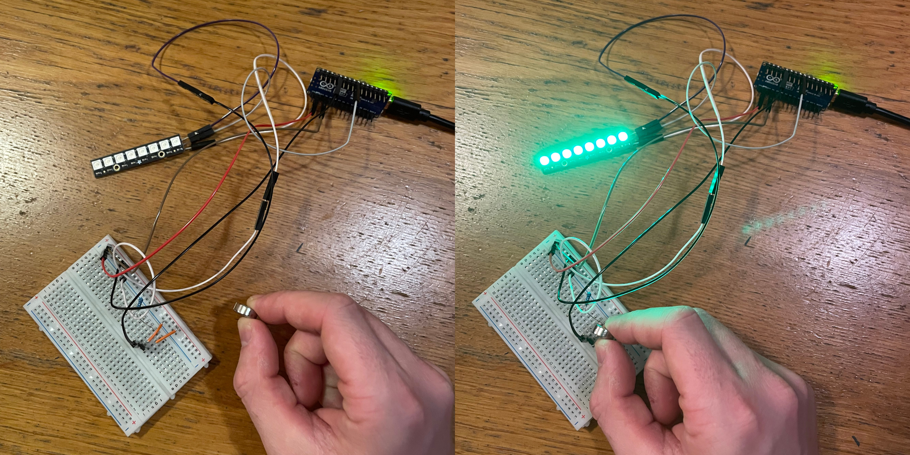

# Arduino stuff  
Here I use an arduino nano every which will control the  

## Hall effect simulation with arduino control  
The idea is for each piece to have a magnet embedded in the base, and a hall effcet sensor underneath every square on the board. This should in theory allow piece movement detection from the arduino continuously checking the hall effect sensors for changes across the board. 

For example, If the arduino detects hall effect on square e2 changing from 'ON' -> 'OFF', and then detects square e4 changing from 'OFF' -> 'ON', this message can be relayed to the raspbi as a piece move e2->e4. Note that exact piece detection is not possible, so the piece moved will depend on the current game state/board setup (this move could be a pawn early on, or a queen later etc. - the game will just update from whatever piece was on the origin square. 

Here is a wowki hall effect simulation which I used during testing to wire up the hall effect sensor and the LED strip.  

  

The aim was to have a message printed and the LED strip to light up when a magnet is near the hall effect sensor. 

Here's a simulation with a button used in place of the hall effect sensor. Pressing the button demonstrates how the circuit would react to a magnet being present: https://wokwi.com/projects/458314087442075649

Magnet not detected vs. detected by hall effect sensor:  

  

